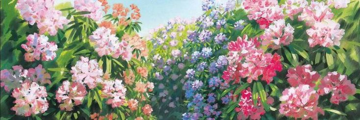

 

**Flower**, Reproductive portion of any flowering plant *(angiosperm)*. Popularly, the term applies especially when part or all of the reproductive structure is distinctive in colour and form. Flowers present a multitude of combinations of colour, size, form, and anatomical arrangement. 

In some plants, individual flowers are very small and are borne in a distinctive cluster *(inflorescence)*. Each flower consists of a floral axis that bears the essential organs of reproduction *(male stamens and/or female pistils)* and usually accessory organs *(sepals and petals)*; the latter may serve both to attract pollinating insects *(see pollination)* and to protect the essential organs. 

Flower parts are arrayed usually in whorls but sometimes spirally. Four distinct whorls are common: the outer calyx *(sepals)*, the corolla *(petals)*, the androecium *(stamens)*, and, in the centre, the gynoecium *(pistils)*. The sepals are usually greenish and often resemble reduced leaves; the petals are usually colourful and showy. Pollen is produced in the stamens. A pollen-receptive stigma rests atop each pistil. The pistil, made up of one or more carpels, encloses an ovary that contains the ovules, or potential seeds.

After fertilization, the ovary enlarges to form the fruit. Flowers have been symbols of beauty in most civilizations of the world, and flower giving is still among the most popular of social amenities.

You can find more information here about [**FLOWERS**](https://en.wikipedia.org/wiki/Flower#:~:text=Flowers%20consist%20of%20a%20combination,in%20flowering%20plants%20produce%20gametes.).
